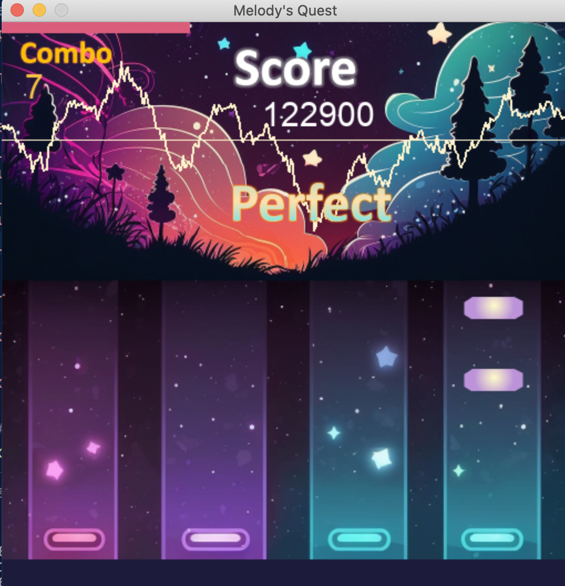

# Melody-Quest
Melody Quest is a rhythm game developed based on PyGame framework. It enables users to import their preferred songs and generates a beatmap for gameplay. 

## Features
- Automatic beatmap generation utilizing music information retrieval techniques
- Onset detection, melody extraction, and separation for precise beatmap creation
- Pitch estimation for accurate note generation
- Mood detection and waveform visualization using machine learning algorithms



## How to run
### Prerequisite
Python 3.10.7

1. Install the dependencies
```plaintext
pip3 install -r requireme
2. Run
```plaintext
python3 main.py
```
3. Select the music file (.wav)

## Details
1. main.py: the main program of the rhythm game 
2. LR_arousal.sav: model to predict arousal level (important)
3. RF_valence.sav: model to predict valence level (important)
4. other image files (.png): assets of the game (important)
5. mood_detection.ipynb: train the mood detection in two dimension (arousal, valence) (for reference only)
6. waveform.py: the program that can draw waveform (for reference only)
7. preprocessing.ipynb: the program that trying the preprocessing (beatmap generation, feature_extraction, mood_dection) (for refrerence only)
8. get_python_library_version: obtain the version of each python packages (for reference only)
